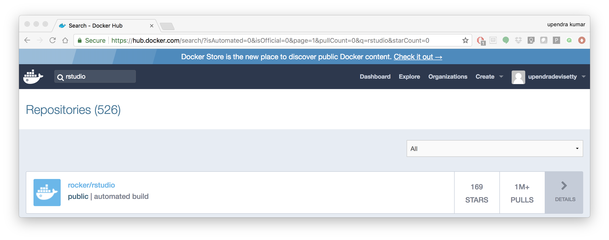
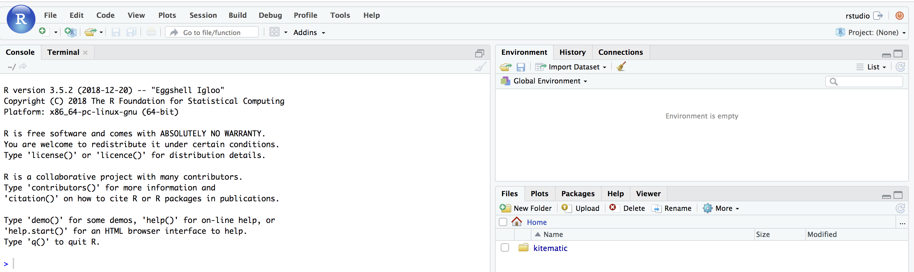

**Docker for Datascience**
--------------------------

For a data scientist, running a container that is already equipped with the libraries and tools needed for a particular analysis eliminates the need to spend hours debugging packages across different environments or configuring custom environments.

But why Set Up a Data Science Environment in a Container?

- One reason is speed. Docker containers allow a Jupyter or RStudio session to launch in minutes, not hours. 

- Containerization benefits both data science and IT/technical operations teams. 

- Containers solve a lot of common problems associated with doing data science work at the enterprise level. They take the pressure off of IT to produce custom environments for every analysis, standardize how data scientists work, and ensure that old code doesn’t stop running because of environment changes.

- Configuring a data science environment can be a pain. Dealing with inconsistent package versions, having to dive through obscure error messages, and having to wait hours for packages to compile can be frustrating. This makes it hard to get started with data science in the first place, and is a completely arbitrary barrier to entry.

Thanks to the rich ecosystem, there are already several readily available images for the common components in data science pipelines. Here are some Docker images to help you quickly spin up your own data science pipeline:

- `MySQL <https://hub.docker.com/_/mysql/>`_
- `Postgres <https://hub.docker.com/_/postgres/>`_
- `Redmine <https://hub.docker.com/_/redmine/>`_
- `MongoDB <https://hub.docker.com/_/mongo/>`_
- `Hadoop <https://hub.docker.com/r/sequenceiq/hadoop-docker/>`_
- `Spark <https://hub.docker.com/r/sequenceiq/spark/>`_
- `Zookeeper <https://hub.docker.com/r/wurstmeister/zookeeper/>`_
- `Kafka <https://github.com/spotify/docker-kafka>`_
- `Cassandra <https://hub.docker.com/_/cassandra/>`_
- `Storm <https://github.com/wurstmeister/storm-docker>`_
- `Flink <https://github.com/apache/flink/tree/master/flink-contrib/docker-flink>`_
- `R <https://github.com/rocker-org/rocker>`_

**Motivation:** Say you want to play around with some cool data science libraries in Python or R but what you don’t want to do is spend hours on installing Python or R, working out what libraries you need, installing each and every one and then messing around with the tedium of getting things to work just right on your version of Linux/Windows/OSX/OS9 — well this is where Docker comes to the rescue! With Docker we can get a Jupyter ‘Data Science’ notebook stack up and running in no time at all. Let’s get started! We will see few examples of these in the following sections...

1. Launch a Jupyter notebook conatiner
======================================

Docker allows us to run a ‘ready to go’ Jupyter data science stack in what’s known as a container:

.. code-block:: bash

	$ docker run --rm -p 8888:8888 jupyter/minimal-notebook

Once you’ve done that you should be greeted by your very own containerised Jupyter service!

|jn_login|

To create your first notebook, drill into the work directory and then click on the ‘New’ button on the right hand side and choose ‘Python 3’ to create a new Python 3 based Notebook. 

|jn_login2|

Now you can write your python code. Here is an example

|jn_login3|

|jn_login3.5|

To mount the host directory inside the Jupyter notebook container, you must first grant the within-container notebook user or group (NB_UID or NB_GID) write access to the host directory

.. code-block:: bash

	sudo chown 1000 <host directory>

you can run the command as below

.. code-block:: bash

	$ docker run --rm -p 8888:8888 -v $PWD:/work -w /home/jovyan/work jupyter/minimal-notebook

.. Tip::

	If you want to run `Jupyter-lab` instead of the default Jupyter notebook, you can do so by adding `jupyter-lab` at the end of the command.

More options for Datascience jupyter notebook - https://github.com/Paperspace/jupyter-docker-stacks/tree/master/datascience-notebook

To shut down the container once you’re done working, simply hit Ctrl-C in the terminal/command prompt. Your work will all be saved on your actual machine in the path we set in our Docker compose file. And there you have it — a quick and easy way to start using Jupyter notebooks with the magic of Docker.

2. Launch a RStudio container
=============================

Next, we will see a Docker image from Rocker which will allow us to run RStudio inside the container and has many useful R packages already installed.

|rstudio_ss|

.. code-block:: bash

	$ docker run --rm -d -e PASSWORD=rstudio1 -p 8787:8787 rocker/rstudio:3.5.2

The command above will lead RStudio-Server to launch invisibly. To connect to it, open a browser and enter http://localhost:8787, or <ipaddress>:8787 on cloud.

|rstudio_login2|

.. Tip::

	For the current Rstudio container, the default username is `rstudio` and the password is `rstudio1`. However you can override the disable the log-in with `-e DISABLE_AUTH=true` in place of `-e PASSWORD=rstudio1`. 

|rstudio_login|

If you want to mount the host directory inside the Rstudio container, you can do as below

.. code-block:: bash

	$ docker run -v $PWD:/data -w /data -p 8787:8787 -e DISABLE_AUTH=true --rm rocker/rstudio:3.5.2

And navigate to the `/data` inside the container using the file browser option in Rstudio.

An excellent R tutorial for reproducible research can be found `here <https://ropenscilabs.github.io/r-docker-tutorial/>`_

3. Machine learning using Docker
================================

In this simple example we’ll take a sample dataset of fruits metrics (like size, weight, texture) labelled apples and oranges. Then we can predict the fruit given a new set of fruit metrics using scikit-learn’s decision tree

You can find the above code in this `github repo <https://github.com/upendrak/scikit_tree_docker>`_ 

1. Create a directory that consists of all the files

.. code-block:: bash

	$ mkdir scikit_docker && cd scikit_docker

2. Create ``requirements.txt`` file — Contains python modules and has nothing to do with Docker inside the folder - ``scikit_docker``.

.. code-block:: bash

	numpy
	scipy
	scikit-learn

3. Create a file called ``app.py`` inside the folder — ``scikit_docker``

.. code-block:: bash

	from sklearn import tree
	#DataSet
	#[size,weight,texture]
	X = [[181, 80, 44], [177, 70, 43], [160, 60, 38], [154, 54, 37],[166, 65, 40], [190, 90, 47], [175, 64, 39], [177, 70, 40], [159, 55, 37], [171, 75, 42], [181, 85, 43]]

	Y = ['apple', 'apple', 'orange', 'orange', 'apple', 'apple', 'orange', 'orange', 'orange', 'apple', 'apple']

	#classifier - DecisionTreeClassifier
	clf_tree = tree.DecisionTreeClassifier();
	clf_tree = clf_tree.fit(X,Y);

	#test_data
	test_data = [[190,70,42],[172,64,39],[182,80,42]];

	#prediction
	prediction_tree = clf_tree.predict(test_data);

	# Write output to a file
	with open("output.txt", 'w') as fh_out:
		fh_out.write("Prediction of DecisionTreeClassifier:")
		fh_out.write(str(prediction_tree))

4. Create a Dockerfile that contains all the instructions for building a Docker image inside the project directory

.. code-block:: bash

	# Use an official Python runtime as a parent image
	FROM python:3.6-slim
	MAINTAINER Upendra Devisetty <upendra@cyverse.org>
	LABEL Description "This Dockerfile is used to build a scikit-learn’s decision tree image"

	# Set the working directory to /app
	WORKDIR /app

	# Copy the current directory contents into the container at /app
	ADD . /app

	# Install any needed packages specified in requirements.txt
	RUN pip install -r requirements.txt

	# Define environment variable
	ENV NAME World

	# Run app.py when the container launches
	CMD ["python", "app.py"]

5. Create a Docker compose YAML file

.. code-block:: bash

	version: '2'
	services:
	    datasci:
	        build: .
	        volumes:
	            - .:/app

5. Now Build and Run the Docker image using `docker-compose up` command to predict the fruit given a new set of fruit metrics

.. code-block:: bash

	$ docker-compose up 

Use `docker-compose rm` to remove the container after docker-compose finish running

.. code-block:: bash

	docker-compose rm 
	Going to remove scikitdocker_datasci_1
	Are you sure? [yN] y
	Removing scikitdocker_datasci_1 ... done

You will find the ouput file in the `scikit_docker` folder with the following contents

4. jupyter-repo2docker
======================

`jupyter-repo2docker` is a tool to build, run, and push Docker images from source code repositories that run via a Jupyter server.

repo2docker fetches a repository (from GitHub, GitLab or other locations) and builds a container image based on the configuration files found in the repository. It can be used to explore a repository locally by building and executing the constructed image of the repository, or as a means of building images that are pushed to a Docker registry

In order to run `jupyter-repo2docker`, you first need to install it locally onto your computer

.. code-block:: bash

	pip install jupyter-repo2docker

Usage
~~~~~

The core feature of `jupyter-repo2docker` is to fetch a git repository (from GitHub or locally), build a container image based on the specifications found in the repository & optionally launch the container that you can use to explore the repository.

.. Note::

	Docker needs to be running on your machine for this to work.

Let's take a simple example:

.. code-block :: bash

	jupyter-repo2docker https://github.com/norvig/pytudes

After building (it might take a while!), it should output in your terminal something like:

.. code-block:: bash

	Copy/paste this URL into your browser when you connect for the first time,
    to login with a token:
        http://0.0.0.0:36511/?token=f94f8fabb92e22f5bfab116c382b4707fc2cade56ad1ace0

Intermediate example:

.. important::

	`repo2docker` looks for configuration files in the repository being built to determine how to build it. In general, repo2docker uses the same configuration files as other software installation tools, rather than creating new custom configuration files. `Here <https://repo2docker.readthedocs.io/en/latest/config_files.html>`_ is a list of supported configuration files (roughly in the order of build priority). For this example, I have already created `requirements.txt` file.

.. code-block:: bash

	jupyter-repo2docker https://github.com/upendrak/keras_wine

After building (it might take a while for the first time), it should output in your terminal something like this.

.. code-block:: bash

	Or copy and paste one of these URLs:
        http://127.0.0.1:55869/?token=103a016fd2e6b04ce7108ce19d078ecef74475dfacce7bd3

If you copy paste that URL into your browser you will see a Jupyter Notebook with the contents of the repository you had just built!

For more information on how to use repo2docker, see the `usage guide <https://repo2docker.readthedocs.io/en/latest/usage.html>`_.

5. Binder
=========

**Binder** allows you to create custom computing environments that can be shared and used by many remote users. It is powered by `BinderHub <https://github.com/jupyterhub/binderhub>`_, which is an open-source tool that deploys the Binder service in the cloud. One-such deployment lives here, at mybinder.org, and is free to use. For more information about the mybinder.org deployment and the team that runs it, see `About mybinder.org <https://mybinder.readthedocs.io/en/latest/about.html#about>`_.

.. Note ::

	Binder is a research pilot, whose main goal is to understand usage patterns and workloads for future evolution and development. It is not a service that can be relied on for critical operations.

Continuing the `keras_wine` github example, let's create a Binder button to make it easy for the users to launch the notebooks interactively from the README in the github repo of `keras_wine`.

.. code-block:: bash

	

Clicking the button will make the jupyer notebook interactive.

.. |jn_login| image:: ../img/jn_login.png
	:width: 700

.. |jn_login2| image:: ../img/jn_login2.png
	:width: 700

.. |jn_login3| image:: ../img/jn_login3.png
	:width: 700

.. |rstudio_login2| image:: ../img/rstudio_login2.png
	:width: 700

