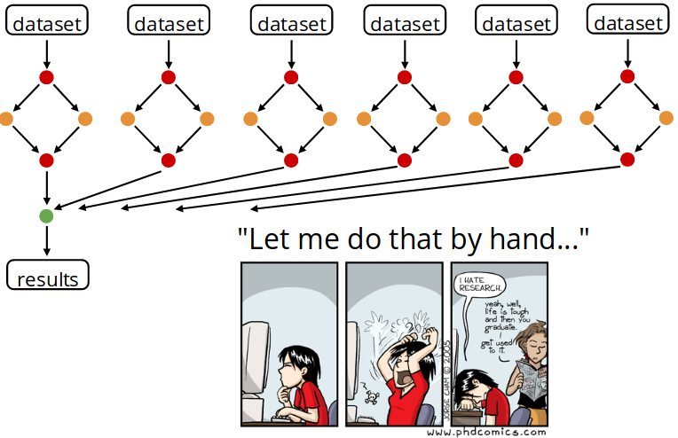

**Containerized Workflows**
---------------------------

Intro to workflows for efficient automated data analysis, using snakemake
=========================================================================

|snakemake|

**Authors:** 

> C. Titus Brown, titus@idyll.org

> Sateesh Peri, https://sateeshperi.github.io/

.. warning ::

	No license; the below content is under CC0. (Do with it what you will, and I hope it's useful!)

In this breakout session you'll learn about `snakemake <https://snakemake.readthedocs.io/en/stable/>`_, a workflow management system consisting of a text-based workflow specification language and a scalable execution environment. You will be introduced to the Snakemake workflow definition language and how to use the execution environment to scale workflows to compute servers and clusters while adapting to hardware specific constraints. 

Snakemake is designed specifically for computationally intensive and/or complex data analysis pipelines. The name is a reference to the programming language Python, which forms the basis for the Snakemake syntax. 

.. Note ::

	You don't need to be an expert at Python to use Snakemake, but it can sometimes be very useful.

Setup
~~~~~

We're going to use mybinder.org, a fantastic service that lets us run demonstrations and short workshops in the cloud! Click on the button below to get started `Launch Binder <https://mybinder.org/v2/gh/ctb/2019-snakemake-ucdavis/feb2019?urlpath=rstudio>`_

Software we're going to use
~~~~~~~~~~~~~~~~~~~~~~~~~~~

For this session, we're going to be using `conda <https://conda.io/en/latest/>`_ and `snakemake <https://snakemake.readthedocs.io/en/stable/>`_, a well as packages from `bioconda <https://bioconda.github.io/>`_. If you wanted to run all of this on your own computer, you'll need to follow the bioconda install instructions.

We'll be implementing a short read quality check and trimming pipeline, using `fastqc <https://www.bioinformatics.babraham.ac.uk/projects/fastqc/>`_, `trimmomatic <http://www.usadellab.org/cms/?page=trimmomatic>`_, and `multiqc <https://multiqc.info/>`_.

You can see the full set of installed software requirements `here <https://github.com/ctb/2019-snakemake-ucdavis/blob/master/binder/environment.yml>`_, in a conda `environment.yml` file.

You could use this install file to run everything we're doing today on your laptop, with:

.. code-block ::bash

	conda env create --file environment.yml -n smake
	conda activate smake

Introduction
~~~~~~~~~~~~

`Why invest time in workflow management system? <https://hackmd.io/4useBM-tQHGGBg-i_2eAIw#>`_

|rationale|

Snakemake is a workflow management system that helps you build pipelines between the scripts of your project.Snakemake allows you to create a set of rules, each one defining a "step" of your analysis.** 

The rules need to be written in a file called "**Snakefile**". For each step you need to provide:

- **Input** : Data files, scripts, executables or any other files.

- **Expected output**. It's not required to list all possible outputs. Just those that you want to monitor or that are used by a subsequent step as inputs.

- A **command** to run to process the input and create the output.

.. code-block ::bash

	rule myname:
	    input: ['myinput1', 'myinput2']
	    output: ['myoutput']
	    shell: 'Some command to go from in to out'

.. information ::

	https://github.com/ctb/2019-snakemake-ucdavis/blob/master/tutorial.md

`Additional Reading <https://hackmd.io/ZA42KGMSQDOAw89b93HHMA#>`_

- `rnaseq-star-deseq2 snakemake workflow <https://github.com/snakemake-workflows/rna-seq-star-deseq2>`_

- `Snakemake Documentation <https://snakemake.readthedocs.io/en/stable/index.html>`_

- `Snakemake Paper <https://academic.oup.com/bioinformatics/article/28/19/2520/290322>_`

- Challenge `exercise <https://davetang.org/muse/2017/10/25/getting-started-hisat-stringtie-ballgown>`_

- Awesome snakemake development `youtube video <https://www.youtube.com/watch?v=bq3vXrWw1yk>`_

.. |snakemake| image:: ../img/snakemake.png
  :width: 700

