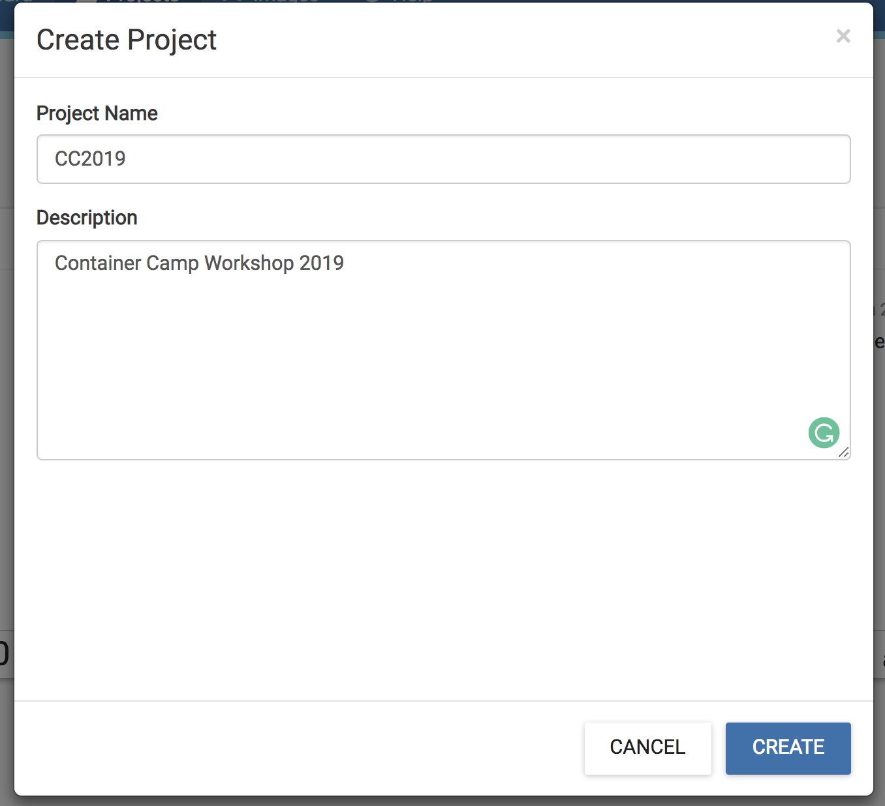
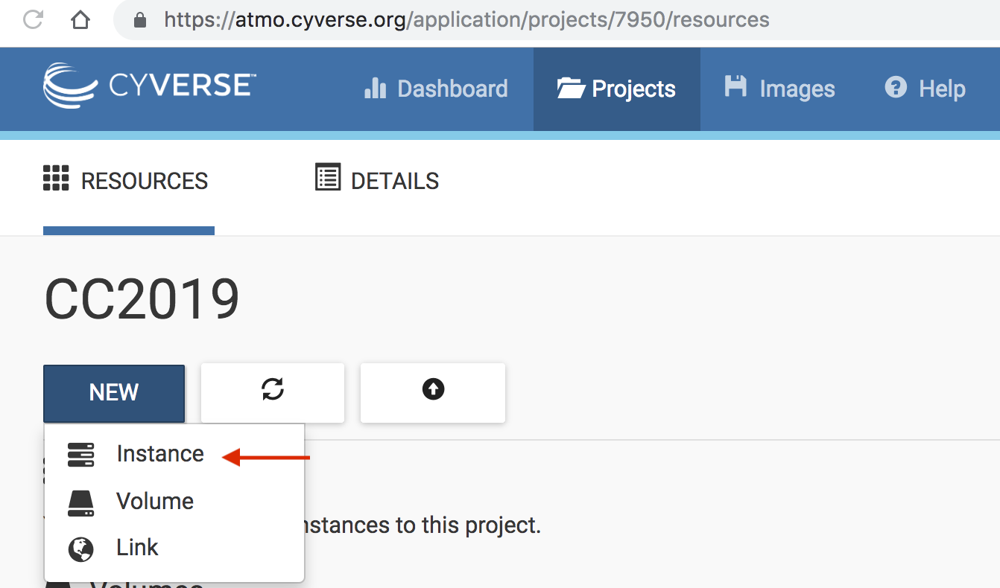
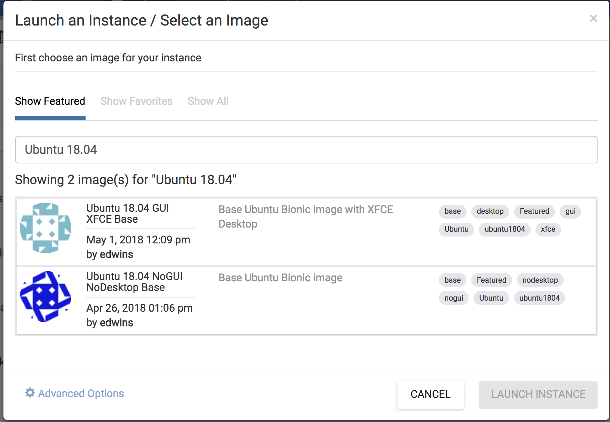
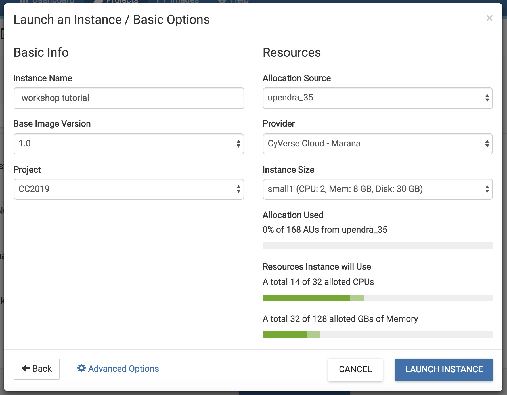
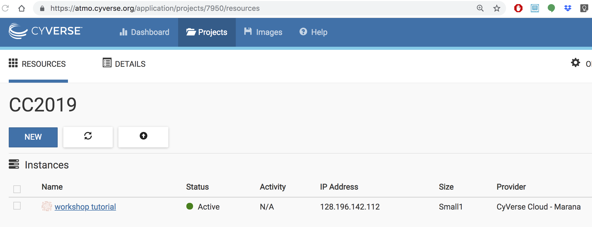
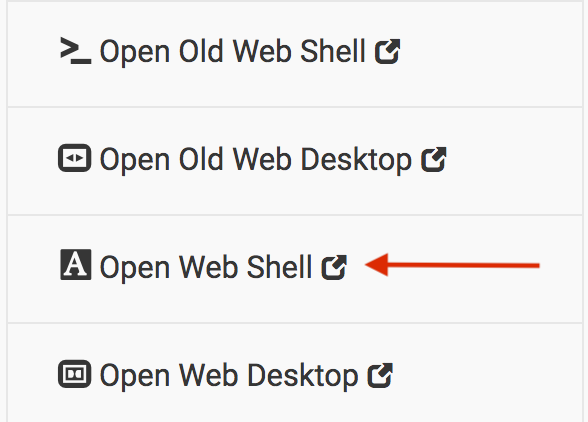
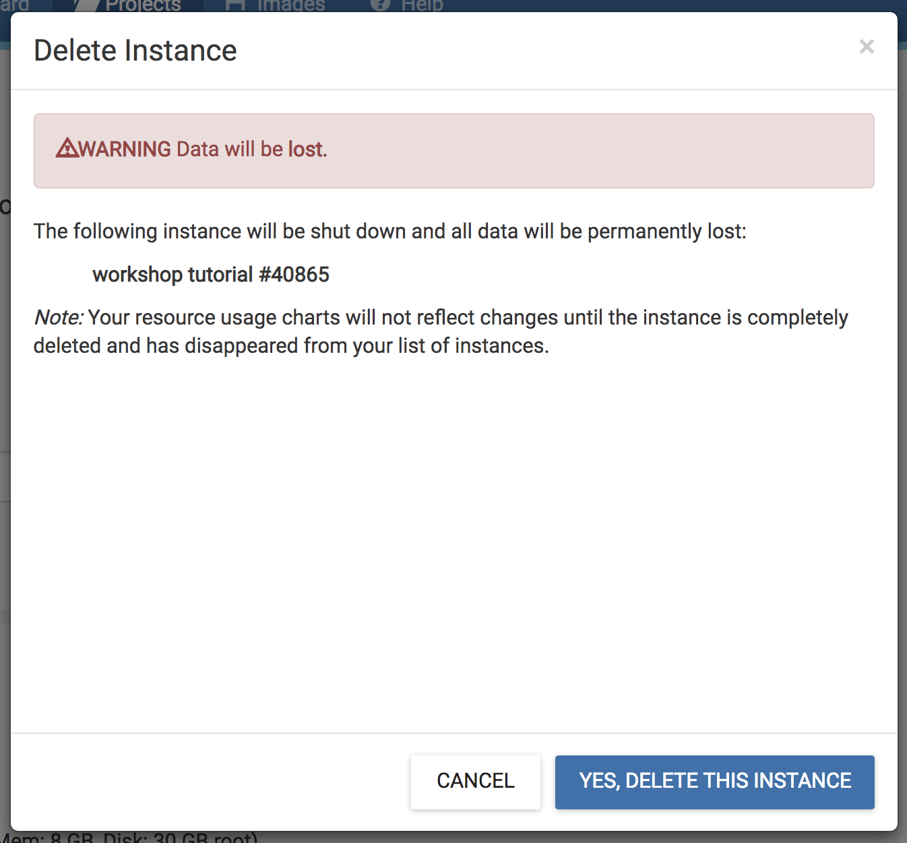
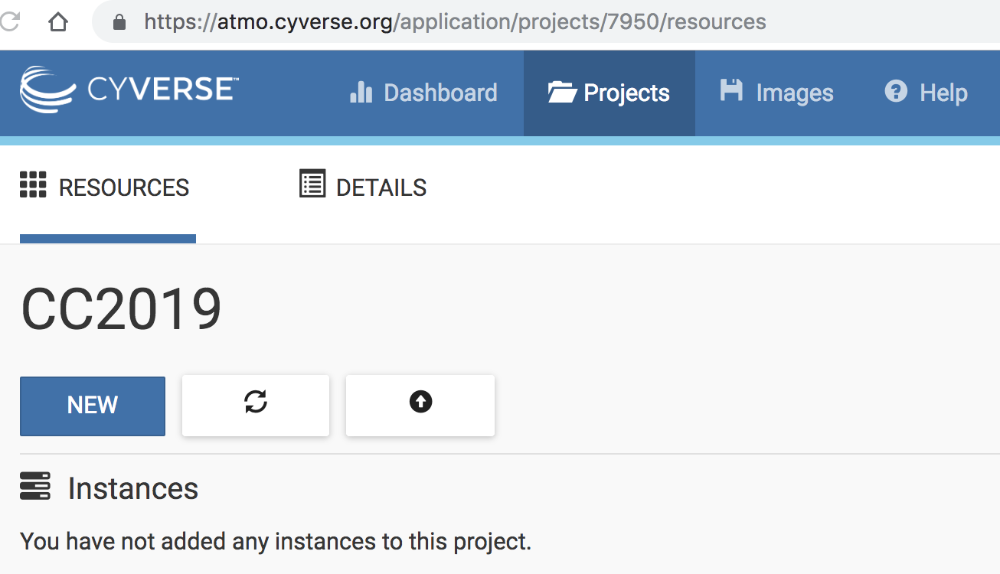

|CyVerse logo|_

**Booting a CyVerse Atmosphere instance**
=========================================

In this session, we will walk through how to start up a running computer (an "instance") on the CyVerse Atmosphere Cloud service. Here is the `Atmosphere manual <https://wiki.cyverse.org/wiki/display/atmman/Atmosphere+Manual+Table+of+Contents>`_ if you are interested in learning more about CyVerse Atmosphere 

Below, we've provided screenshots of the whole process. You can click on them to zoom in a bit. The important areas to fill in are highlighted. 

First, go to the `Atmosphere <https://atmo.cyverse.org>`_ application and then click **login** 

.. important::

  You will need to have access to the Atmosphere workshop cloud. If you are unable to log-in for some reason, please let us know and we will fix it immediately.

1. Fill in the username and password and click **LOGIN**

Fill in the username, which is your CyVerse username, and then enter the password which is your CyVerse password.

|atmo-1.1|
           
2. Select Projects and **Create New Project**

- Now, this is something you only need to do once.

- We'll do this with Projects, which gives you a bit of a workspace in which to keep things that belong to *you*.

- Click on the **Projects** tab on the top and then click **CREATE NEW PROJECT**

- Enter the name **CC2019** into the Project Name box, and something simple like **Container Camp Workshop 2019** into the description. Then click **create**.

|atmo_cp|

3. Select the newly created project

- Click on your newly created project!
           
- Now, click **New** and then **Instance** from the dropdown menu to start up a new virtual machine.

|atmo_launch0|

- Find the **Ubuntu 18.04** image, click on it

|atmo_launch1|

- Name it something simple such as **workshop tutorial** and select **small1 (CPU: 2, Mem: 8GB, Disk: 30GB)**.

- Leave rest of the fields as default.

|atmo_launch|

- Wait for it to become active

- It will now be booting up! This will take 2-10 minutes, depending. Just wait! Don't reload or do anything.

|atmo-6|

- Click on your new instance to get more information!

- Now, you can either click **Open Web Shell**, *or*, you can ssh in with your CyVerse username on the IP address of the machine. For using **Open Web Shell**, click on the name of the instance and it will take you to the next screen. You'll find the **Open Web Shell** underneath the Actions menu on the right.

**Deleting your instance**

- To completely remove your instance, you can select the **Delete** buttom from the instance Actions page. 

- This will open up a dialogue window. Select the **Yes, delete this instance** button.

|atmo-8|

.. important::

Before deleting an instance make sure you backup your data, once the instance is deleted, there is no way you can get the data back. It is recommended to `attach the volume to the instance <https://wiki.cyverse.org/wiki/display/atmman/Attaching+and+Detaching+Volumes>`_ and do your analysis there.

- It may take Atmosphere a few minutes to process your request. The instance should disappear from the project when it has been successfully deleted. 

|atmo-9|

.. Note::

  It is advisable to delete the machine if you are not planning to use it in future to save valuable resources. However if you want to use it in future, you can suspend it.

.. |CyVerse logo| image:: ../img/cyverse_rgb.png
    :width: 500
.. _CyVerse logo: http://learning.cyverse.org/

