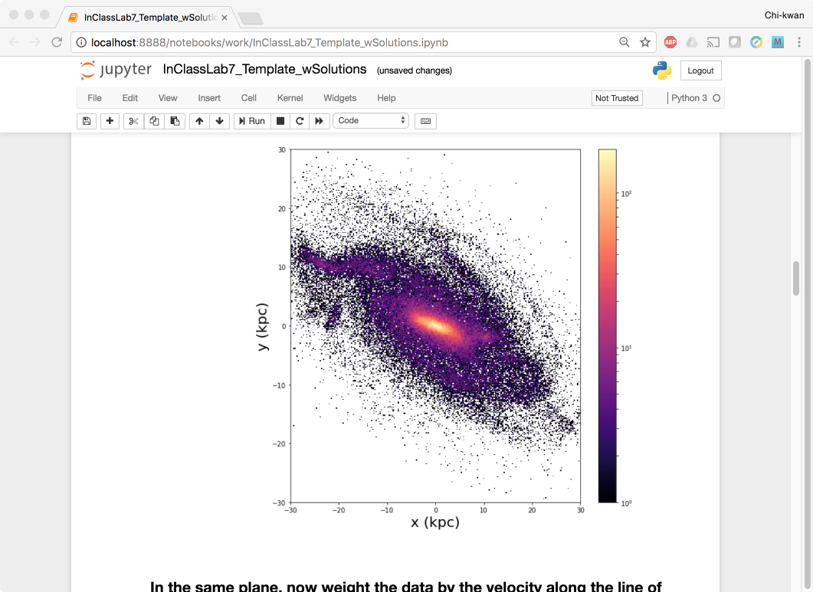

**Docker hands-on exercises**
-----------------------------

1. Data Management Hands-on
===========================

Form the "Introduction to Docker" session this morning, we learned that a running Docker container is an isolated environment created from a Docker image.  This means, although it is possible to store data within the "writable layer" of a container, there are some limitations:

- The data doesn't persist when that container is no longer running, and it can be difficult to get the data out of the container if another process needs it.

- A container's writable layer is tightly coupled to the host machine where the container is running. You can't easily move the data somewhere else.

Docker offers three different ways to mount data into a container from the Docker host: **volumes**, **bind mounts**, or **tmpfs volumes**.  For simplicity, we will only use bind mounts in our hands-on session, even though volumes is the more powerful and usable option for most use cases.

1.1 Bind mounts
~~~~~~~~~~~~~~~

**Bind mounts:** When you use a bind mount, a file or directory on the host machine is mounted into a container.

.. image:: ../img/bind_mount.png
  :scale: 100%
  :align: center

.. Warning::

	One side effect of using bind mounts, for better or for worse, is that you can change the host filesystem via processes running in a container, including creating, modifying, or deleting important system files or directories. This is a powerful ability which can have security implications, including impacting non-Docker processes on the host system.

	If you use ``--mount`` to bind-mount a file or directory that does not yet exist on the Docker host, Docker does not automatically create it for you, but generates an error.

Let's clone a git repository to obtain our data sets:

.. code-block:: bash

	$ git clone https://github.com/CyVerse-learning-materials/ccw-2019-astro.git

We can ``cd`` into the HOPS work directory, and mount it to ``/root`` as we launch the ``eventhorizontelescope/hops`` container:

.. code-block:: bash

	$ cd ccw-2019-astro/hops
	$ ls
	1234
	$ docker run -it --rm --name hops -v $PWD:/root eventhorizontelescope/hops
	Setup HOPS v3.19 with HOPS_ROOT=/root for x86_64-3.19

You will start at the ``/root`` work directory and the host data ``1234`` is available in it:

.. code-block:: bash

	$ pwd
	/root
	$ ls
	1234

You can open another terminal and use ``docker inspect hops | grep -A9 Mounts`` to verify that the bind mount was created correctly.  Looking for the "Mounts" section,

.. code-block:: bash

	$ docker inspect hops | grep -A9 Mounts
        "Mounts": [
            {
                "Type": "bind",
                "Source": "/Users/ckchan/ccw-2019-astro/hops",
                "Destination": "/root",
                "Mode": "",
                "RW": true,
                "Propagation": "rprivate"
            }
        ],

This shows that the mount is a bind mount with correct source and target.  It also shows that the mount is read-write, and that the propagation is set to rprivate.

Use case 1: Processing VLBI data with HOPS in Docker
~~~~~~~~~~~~~~~~~~~~~~~~~~~~~~~~~~~~~~~~~~~~~~~~~~~~

HOPS stands for the Haystack Observatory Postprocessing System.  It is a standard tool used in Very-long-baseline interferometry (VLBI) to perform data analysis.  HOPS has a long history and it depends on legacy libraries.  This makes it difficult to compile on modern Unix/Linux systems.  Nevertheless, with Docker, you **have** already launched a HOPS envirnment that you can analysis VLBI data!

The most basic step in analysis VLBI is called "fringe fitting", which we will perform in the running HOPS container by

.. code-block:: bash

	$ ls 1234/No0055/
	3C279.zxxerd  L..zxxerd  LL..zxxerd  LW..zxxerd  W..zxxerd  WW..zxxerd
	$ fourfit 1234
	fourfit: Warning: No valid data for this pass for pol 2
	fourfit: Warning: No valid data for this pass for pol 3
	$ ls 1234/No0055/
	3C279.zxxerd  LL..zxxerd     LL.B.2.zxxerd  LW.B.3.zxxerd  W..zxxerd   WW.B.5.zxxerd
	L..zxxerd     LL.B.1.zxxerd  LW..zxxerd     LW.B.4.zxxerd  WW..zxxerd

``fourfit`` reads in the correlated data and create the so called "fringe files". The warnings are normal because there are missing polarizations in the data. In order to see the result of the fringe fitting, you can use ``fplot``:

.. code-block:: bash

	$ fplot -d %04d.ps 1234
	$ ls
	0000.ps  0001.ps  0002.ps  0003.ps  0004.ps  1234

You just created 4 fringe plots which contain all important information of the VLBI experiment!  Now you can exit your HOPS container and open them on your host machine.

2. Jupyter Notebook Hands-on
============================

Mounting a host directory is one way to make a container connect with the outside work. Another possible is through network by exposing a port.

Use case 2: Processing Galaxy Simulation with Jupyter in Docker
~~~~~~~~~~~~~~~~~~~~~~~~~~~~~~~~~~~~~~~~~~~~~~~~~~~~~~~~~~~~~~~

In this second use case, we will use Docker to run a "ready to go" Jupyter notebook in a container.  We will expose the port 8888 from the container to the localhost so that you can connect to the notebook.

Inside the ``ccw-2019-astro`` git repository that you downloaded earlier, there is a sample Galaxy simulation:

.. code-block :: bash

	$ pwd
	/Users/ckchan/ccw-2019-astro/hops
	$ cd ../galaxy/
	$ pwd
	/Users/ckchan/ccw-2019-astro/galaxy

	# Specify the uid of the jovyan user.  Useful to mount host volumes with specific file ownership.  For this option to take effect, you must run the container with --user root

	$ docker run -it --rm -v $PWD:/home/jovyan/work -p 8888:8888 -e NB_UID=$(id -u) --user root astrocontainers/jupyter
	Set username to: jovyan
	usermod: no changes
	Set jovyan UID to: 1329
	Executing the command: jupyter notebook
	[I 23:36:09.446 NotebookApp] Writing notebook server cookie secret to /home/jovyan/.local/share/jupyter/runtime/notebook_cookie_secret
	[W 23:36:09.686 NotebookApp] WARNING: The notebook server is listening on all IP addresses and not using encryption. This is not recommended.
	[I 23:36:09.722 NotebookApp] JupyterLab beta preview extension loaded from /opt/conda/lib/python3.6/site-packages/jupyterlab
	[I 23:36:09.722 NotebookApp] JupyterLab application directory is /opt/conda/share/jupyter/lab
	[I 23:36:09.730 NotebookApp] Serving notebooks from local directory: /home/jovyan
	[I 23:36:09.730 NotebookApp] 0 active kernels
	[I 23:36:09.730 NotebookApp] The Jupyter Notebook is running at:
	[I 23:36:09.730 NotebookApp] http://[all ip addresses on your system]:8888/?token=a81dbeec92b286df393bb484fdf53efffab410fd64ec8702
	[I 23:36:09.730 NotebookApp] Use Control-C to stop this server and shut down all kernels (twice to skip confirmation).
	[C 23:36:09.731 NotebookApp]
	Copy/paste this URL into your browser when you connect for the first time,
    to login with a token:
    	http://localhost:8888/?token=dfb50de6c1da091fd62336ac52cdb88de5fe339eb0faf478

The last line is a URL that we need to copy and paste into our browser to access our new Jupyter Notebook:

.. code-block:: bash

	http://localhost:8888/?token=dfb50de6c1da091fd62336ac52cdb88de5fe339eb0faf478

.. warning::

	Do not copy and paste the above URL in your browser as this URL is specific to my environment and it doesn't work for you.

.. image:: ../img/jn_login.png
  :width: 700
  :height: 294
  :align: center

Once you've done that you should be greeted by your very own containerised Jupyter service!  Now open ``work/InClassLab7_Template_wSolutions.ipynb`` and try analysis a Galaxy simulation!

To shut down the container once you're done working, simply hit ``Ctrl-C`` in the terminal/command prompt.  Your work will all be saved on your actual machine in the path we set in our Docker compose file.  And there you have it — a quick and easy way to start using Jupyter notebooks with the magic of Docker.
