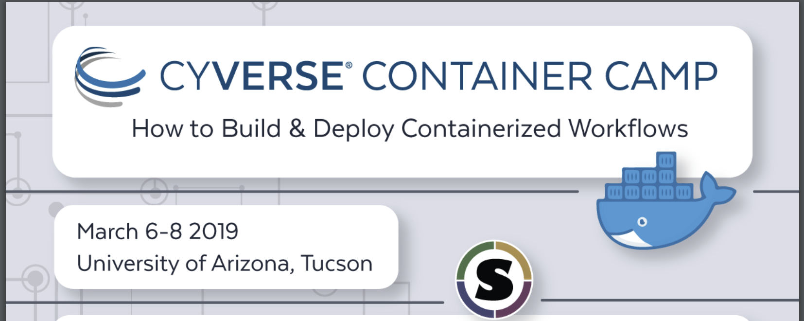

|cc-main|

**Container technologies** are letting researchers easily share, scale, and reuse tools and workflows for all types of computational analyses. CyVerse Container Camp is an intensive three day hands-on workshop to learn how to create, us, and deploy containers across a variety of compute systems (your computer, local HPC cloud compute environments, and national resources such as OSG). 

In this 3-day workshop, users will blend practical theory and hands-on exercises where small groups deploy tools and workflows they bring to the workshop.

Expected outcomes:
------------------

- How to containerize applications and workflows
- How to use other containerized applications and workflows
- How to build/deploy containerized applications and workflows
- How to scale out your computation from laptop to cloud to HPC/OSG

.. toctree::
   :maxdepth: 1
   :caption: Getting Started

   getting_started/main
   getting_started/installation
   getting_started/agenda
   getting_started/about_cyverse

.. toctree::
   :maxdepth: 1
   :caption: Workshop Topics

   topics/train_docker
   topics/train_singularity
   topics/breakout_session

.. toctree::
   :maxdepth: 1
   :caption: Docker

   docker/dockerintro
   docker/dockeradvanced

.. toctree::
   :maxdepth: 1
   :caption: Singularity

   singularity/singularityintro
   singularity/singularityadvanced

.. toctree::
   :maxdepth: 1
   :caption: Breakout Sessions

   breakout/biocontainers
   breakout/nvidia-docker
   breakout/workflows
   breakout/datascience

.. toctree::
   :maxdepth: 1
   :caption: CyVerse Topics

   cyverse/boot
   cyverse/de_docker
   cyverse/vice_docker

.. toctree::
   :maxdepth: 1
   :caption: Useful Resources

   useful_resources/usefulresources_docker
   useful_resources/usefulresources_singularity
   useful_resources/usefulresources_other

.. toctree::
   :maxdepth: 1
   :caption: Instructions and Reporting

   instructions_reporting/instructors
   instructions_reporting/problems

