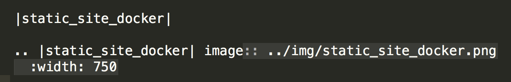

**For instructors!**
====================

**Coordinating Web site work**

Please create a pull request (PR) as soon as you start editing something,
rather than waiting!  That way you can tell others what you're working on.

You could/should also mention it on Slack in the "cc-leads" channel.

**Technical info re adding content to the Web site**

All the Container Camp workshop tutorials are stored on `GitHub <https://github.com/CyVerse-learning-materials/container_camp_workshop_2018>`_.

We will use `GitHub Flow <https://guides.github.com/introduction/flow/>`_ for updates: from the command line,

	- fork the container camp repository;
	- edit, change, add, etc;
	- submit a PR;
	- when ready to review & merge, say 'ready for review & merge @cc2019'.

It's important that all updates go through code review by
someone. Anyone with push access to the repo can review and merge!

From the Web site, you should be able to edit the files and then set up a
PR directly. You can also fork the repo, perform multiple edits and submit a PR through the web interface.

**Updating the "official" Web site.**

The `Web site <https://cyverse-container-camp-workshop-2019.readthedocs-hosted.com/>`_, will update automatically
from GitHub.  However, it may take 5-15 minutes to do so.

**Building a local copy of the Web site.**

Briefly,

- clone the repo:

.. code-block:: bash

  git clone https://github.com/CyVerse-learning-materials/container_camp_workshop_2019.git``

- set up a virtualenv with python2 or python3:

.. code-block:: bash

  python -m virtualenv buildenv -p python3.5; . ~/buildenv/bin/activate

- install the prerequisites:

.. code-block:: bash

  pip install -r requirements.txt
  
- build site: 
  
.. code-block:: bash

  make html

- open / click on

.. code-block:: bash 

  _build/html/index.html

**Formatting, guidelines, etc.**

Everything can/should be in
`Restructured text <https://github.com/adam-p/markdown-here/wiki/Markdown-Cheatsheet!>`_
If you're not super familiar with Restructured text, you can use
`online restructured text editor </http://rst.ninjs.org/>`_ to write your tutorials. 

(Note that you can go visit the github repo and it will helpfully render
`.rst` files for you if you click on them! They just won't have the full
site template.)

Files and images that don't need to be "compiled" and should just be
served up through the web site can be put in the `_static`
directory; their URL will then be

    https://cyverse-container-camp-workshop-2019.readthedocs-hosted.com/_static/filename
    
**Images**

Image formatting in Restructured text is pretty straightforward. Here is an example

|static_site_docker|

The code that generates this image is this

|instructors_code|

.. |static_site_docker| image:: ../img/static_site_docker.png
  :width: 750

